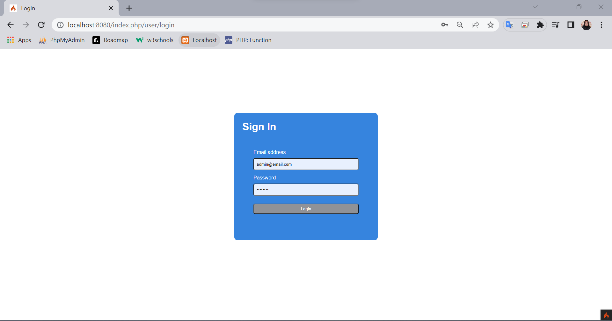
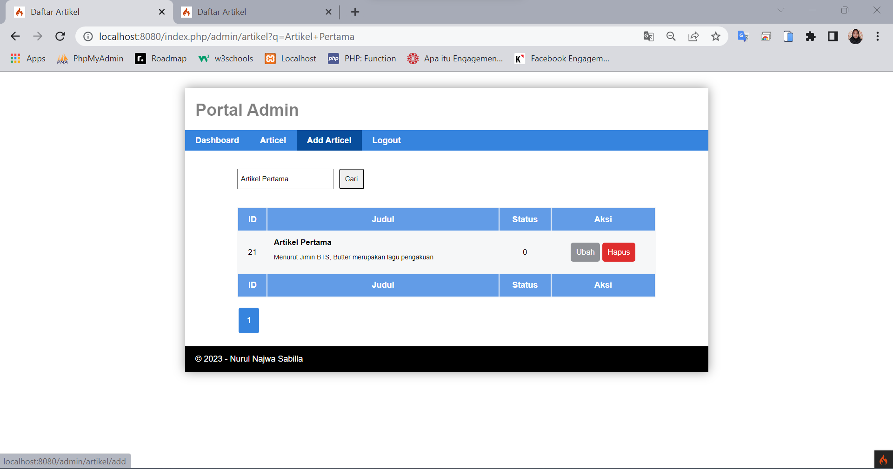

# Praktikum 12: API

```bash
Nama    : Nurul Najwa Sabilla
Kelas   : TI.21.A.3
Nim     : 312110451
```

## Output

```bash
API menggunakan Framework Codeigniter 4.
```

## Menu Admin

1. Sign In u/ Admin



2. Halaman Artikel Admin


3. Pencarian Data Artikel


4. Contoh Pencarian Data



5. Tampilan Penambahan Artikel Terbaru dengan Tampilan Upload Gambar


6. Tampilan Ubah Artikel Terbaru dengan Tampilan Upload Gambar


7. Hapus Artikel


## Menu User

1. Home Terbaru


2. Detail Terbaru


## REST API

REST API berisi aturan untuk membuat web service dengan membatasi hak akses client
yang mengakses API.

1. Menampilkan Semua Data dengan Method GET


2. Menampilkan Data Spesifik 

- Mencari data dengan id 22


3. Mengubah Data dengan Method Put

- Tidak ada modelnya

4. Menambahkan Data dengan Method Post

- Menambah data dengan judul "Artikel Keempat" dengan mengisi value sesuai keinginan


- Tampilan saat melihat semua data dengan method get. Akan terlihat dengan id 25


5. Menghapus Data dengan Method Delete

- Menghapus data dengan id 25


- Tampilan saat melihat semua data dengan method get. Maka id 25 akan hilang/terhapus


## Terimkasih(●'◡'●)